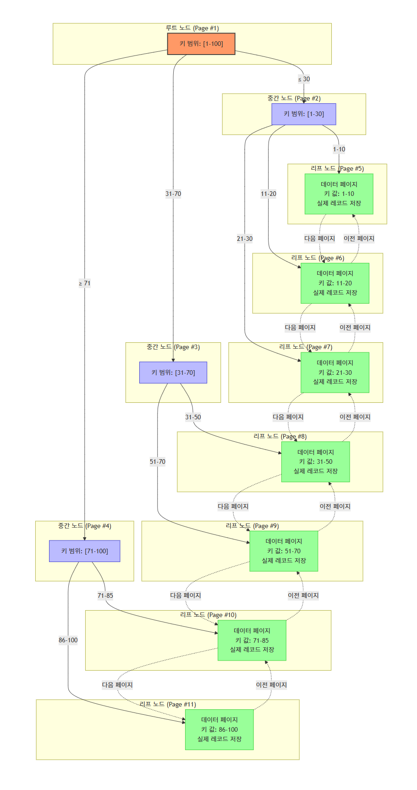
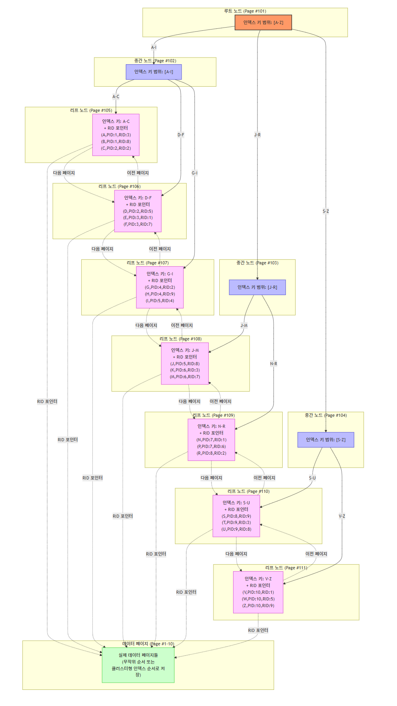

# 전문 검색 인덱스

B-Tree, R-Tree 등의 인덱스 알고리즘은 일반적으로 크지 않은 데이터 또는 이미 키워드화한 작은 값에 대한 인덱싱 알고리즘이다.

B-Tree 인덱스는 실제 컬럼의 값이 1MB이더라도 전체 값을 인덱스 키로 사용하는 것이 아니라 1,000(MyISAM) or 3,072(InnoDB) 바이트 까지만 잘라서 인덱스 키로 사용한다.
또한 B-Tree는 전체 일치 또는 좌측 일부 일치와 같은 검색만 가능하다.

문서의 내용 전체를 인덱스화 해서 특정 키워드가 포함된 문서를 검색하는 Full text 검색에는 InnoDB, MyISAM 스토리지 엔진에서 제공하는 일반적 용도의 B-Tree 인덱스를 사용할 수 없다.

따라서 이러한 한계를 극복하기 위해 문서 전체에 대한 분석과 검색을 위한 알고리즘을 **Full text search 인덱스**라고 한다.(일반화된 기능의 명칭이지 전문 검색 알고리즘의 이름은 아님.)


## 인덱스 알고리즘

전문 검색에서는 문서 본문의 내용에서 사용자가 검색하게 될 키워드를 분석하고 빠른 검색용으로 사용할 수 있게 키워드로 인덱스를 구축한다.

크게 어근 분석과 n-gram 분석 알고리즘을 구분할 수 있다.

### 어근 분석 알고리즘

- 불용어 처리
- 어근 분석


### 불용어
불용어 처리는 검색에서 별 가치가 없는 단어를 모두 필터링해서 제거한다.

조사 혹은 접속사 등..

ex) 을, 를, 에서, 는, 이, 가, 의, 도, 과, 와, 에, 에게, 한테, 으로, 로, 에서, 부터, 까지 등


```text
불용어 제거 전 : ['Family', 'is', 'not', 'an', 'important', 'thing', '.', 'It', "'s", 'everything', '.']
불용어 제거 후 : ['Family', 'important', 'thing', '.', 'It', "'s", 'everything', '.']
```

### 어근 분석
MySQL 서버는 불용어가 소스코드에 정의되어있지만, 사용자가 별도로 불용어 리스트를 지정할 수 있다.

어근 분석은 검색어로 선정된 단어의 뿌리인 원형을 찾는 작업이다.
Mysql 서버에서는 MeCab을 플러그인 형태로 사용할 수 있게 지원한다.

MeCab은 일본어 형태소를 분석하기 위한 오픈소스 라이브러리로, 일본어 문장을 형태소 단위로 분리하고 각 형태소의 품사와 원형을 분석하는 기능을 제공한다.
한글이나 일본어의 경우 영어와 같이 단어의 변형 자체가 거의 없기 때문에 어근 분석보다는 형태소를 분석해서 명사와 조사를 구분하는 기능이 더 중요하다.

서구권에서는 MongoDB에서 사용되는 Snowball 이란 알고리즘이란 오픈 소스가 있다.

중요한 것은 각 국가의 언어가 서로 문법이 다르고 다른 방식으로 발전해왔기 때문에 어근 분석또한 언여별로 방식이 모두 다르다.

## n-gram 알고리즘

MeCab을 위한 형태소 분석은 제대로 활용하기 위해선 많은 노력과 시간을 투자해야한다. 
전문적 검색엔진을 고려하는 것이 아니라면 범용적으로 사용하기 어렵다. 이러한 한계를 극복하기 위해 n-gram 알고리즘이 도입된 것이다.

n-gram 알고리즘은 문장을 n개의 단어로 나누는 알고리즘이다.
형태소 분석보다는 알고리즘이 단순하고 국가별 언어에 대한 이해 작업이 필요없는 장점이 있지만 인덱스 크기가 상당히 커진다.

2-gram의 경우 아래와 같이 자를 수 있다.

```text
To be or not to be. That is the question
```

각 단어는 띄어쓰기와 마침표를 기준으로 10개의 단어로 구분되고, 2글자씩 중첩해서 토큰으로 분리된다.

주의해야할 것은 각 글자가 중첩해서 2글자씩 토큰으로 구분됐다. 따라서 10글자 단어라면 (10-1) 개의 토큰으로 구분된다.

중복된 토큰은 하나의 인덱스 엔트리로 병합되어 저장된다.

| 원본 단어 | 문자 단위 bi-gram |
|---------|-----------------|
| To      | "To"            |
| be      | "be"            |
| or      | "or"            |
| not     | "no", "ot"      |
| to      | "to"            |
| be      | "be"            |
| that    | "th", "ha", "at" |
| is      | "is"            |
| the     | "th", "he"      |
| question| "qu", "ue", "es", "st", "ti", "io", "on" |


MySQL 서버는 위와 같이 생성된 토큰들에 대해 불용어를 걸러내는 작업을 수행하며 이때 동일하거나 포함하는 경우 걸러서 버린다.

```sql
SELECT * FROM information_schema.INNODB_FT_DEFAULT_STOPWORD

a
about
an 
...
```

### 불용어 변경 및 삭제
앞서 본 n-gram의 토큰 파싱 및 불용어 처리 예시에서 결과를 보면 "ti", "at", "ha"와 같은 토큰들은 "a", "i" 철자가 불용어로 등록되어있어서 모두 걸러진다.
이런 처리는 사용자에게 도움되기 보다는 오히려 방해가 된다. 따라서 직접 불용어를 등록하는 방법을 권장한다.


### 전문 검색 인덱스의 불용어 처리 무시

1. MySQL 서버의 모든 전문 검색 인덱스의 불용어를 완전 제거 
   2. my.cnf에서 ft_stopword_file 시스템 변수에 빈 문자열을 설정
3. InnoDB 스토리지 엔진에서 불용어 처리 무시
   4. `SET GLOBAL innodb_ft_enable_stopword = OFF;`

### 사용자 정의 불용어 사용

1. ft_stopword_file='/path/to/stopword.txt' 설정
2. 불용어 목록을 테이블로 저장

```sql
CREATE TABLE my_stopword(value VARCHAR(30)) ENGINE=InnoDB;
INSERT INTO my_stopword VALUES ('MySQL');

SET GLOBAL innodb_ft_user_stopword_table = 'mydb/my_stopword';
ALTER TABLE tb_bi_gram ADD FULLTEXT INDEX fx_title_body(title, body) WITH PARSER ngram;
```

### 전문 검색 인덱스의 가용성
전문 검색 인덱스를 사용하려면 반드시 다음 두 가지 조건을 갖춰야한다.

- 쿼리 문장이 전문 검색을 위한 문법(MATCH ... AGAINST) 사용
- 테이블이 전문 검색 대상 컬럼에 대해 전문 인덱스 보유

```sql
CREATE TABLE tb_test (
    doc_id INT,
    dob_body TEXT,
    PRIMARY KEY (doc_id),
    FULLTEXT INDEX fx_body(dob_body) WITH PARSER ngram
 ) ENGINE=InnoDB;
```

아래와 같은 쿼리로도 원하는 검색결과를 얻을 수 있지만 전문 검색 인덱스를 활용한 쿼리가 실행된게 아니라 풀 테이블 스캔으로 쿼리를 처리한다.

```sql
SELECT * FROM tb_test WHERE dob_body LIKE '%JAVA%';
```

전문 검색 인덱스를 활용하려면?
```sql
SELECT * FROM tb_test WHERE MATCH(dob_body) AGAINST('JAVA' IN BOOLEAN MODE);
```

# 함수 기반 인덱스
일반적 인덱스는 컬럼의 값 일부 또는 전체에 대해서만 인덱스 생성이 허용된다.
하지만 간혹 컬럼의 값을 변형해 만들어진 값에 대해 인덱스를 구축할 케이스도 있는데, 함수 기반 인덱스를 활용하면 된다.

- 가상 컬럼을 이용한 인덱스
- 함수를 이용한 인덱스

함수 기반 인덱스는 인덱싱할 값 계산 과정의 차이만 있고, 내부 구조 및 유지관리 방법은 B-Tree 인덱스와 동일하다.

## 가상 컬럼을 이용한 인덱스
```sql
CREATE TABLE user (
    user_id INT,
    first_name VARCHAR(10),
    last_name VARCHAR(10),
    created_at DATETIME,
    updated_at DATETIME,
    PRIMARY KEY (user_id)
  );
```
만약 first_name과 last_name을 합쳐서 full_name이라는 컬럼을 만들고 싶다면?
```sql
ALTER TABLE user 
    ADD COLUMN full_name VARCHAR(30) AS (CONCAT(first_name, ' ', last_name)) VIRTUAL,
    ADD INDEX idx_full_name (full_name);
```
- VIRTUAL: 가상 컬럼으로 실제로 저장되지 않음
- STORED: 실제로 저장됨

## 함수 기반 인덱스
```sql
CREATE TABLE user (
    user_id INT,
    first_name VARCHAR(10),
    last_name VARCHAR(10),
    created_at DATETIME,
    updated_at DATETIME,
    PRIMARY KEY (user_id),
    INDEX ix_full_name (CONCAT(first_name, ' ', last_name))
  );
```
 
함수를 직접 사용하는 인덱스는 테이블 구조를 변경하지 않고 계산된 결과의 검색을 빠르게 만들어준다.
반드시 조건절에 함수 기반 인덱스에 명시된 표현식이 그대로 사용되어야한다! 

함수 생성 시 명시된 표현식과 쿼리의 WHERE 조건절에 사용된 표현식이 다르다면 옵티마이저는 다른 표현식으로 간주해서 함수 기반 인덱스를 사용하지 못한다.


# 멀티 밸류 인덱스
Full text search index를 제외한 모든 인덱스는 레코드 1건이 1개의 인덱스 키값을 가진다.
즉, 인덱스 키와 데이터 레코드는 1:1 관계를 가진다.

하지만 멀티 밸류 인덱스는 하나의 데이터 레코드가 여러 개의 키 값을 가질 수 있는 형태의 인덱스다.

최근 RDBMS들이 JSON 데이터 타입을 지원하기 시작하면서 JSON 배열 타입의 필드에 저장된 element에 대한 인덱스 요건이 발생해서이다.
MongoDB에서는 처음부터 이러한 형태의 인덱스를 지원했지만 MySQL서버는 지원없이 단순 JSON 컬럼만 지원하였지만 8.0부터 생겼다.

```sql
CREATE TABLE user (
    user_id INT,
    first_name VARCHAR(10),
    last_name VARCHAR(10),
    credit_info JSON,
    INDEX mx_creditscores ( (CAST(credit_info->'$.credit_scores' AS UNSIGNED ARRAY)) )
  );

INSERT INTO user VALUES (1, 'John', 'Doe', '{"credit_scores": [700, 800]}');
```

멀티 밸류 인덱스를 활용하기 위해 일반적 조건 방식을 사용하면 안 되고 아래 함수를 이용하여 옵티마이저가 인덱스를 활용한 쿼리를 작성할 수 있도록 해야한다.

- MEMBER_OF ()
- JSON_CONTAINS ()
- JSON_OVERLAPS ()

```sql
SELECT * FROM user WHERE 700 MEMBER OF (credit_info->'$.credit_scores');
```
| user\_id | first\_name | last\_name | credit\_info |
| :--- | :--- | :--- | :--- |
| 1 | John | Doe | {"credit\_scores": \[700, 800\]} |


```sql
EXPLAIN SELECT * FROM user WHERE 700 MEMBER OF (credit_info->'$.credit_scores');
```

| id | select\_type | table | partitions | type | possible\_keys | key | key\_len | ref | rows | filtered | Extra |
| :--- | :--- | :--- | :--- | :--- | :--- | :--- | :--- | :--- | :--- | :--- | :--- |
| 1 | SIMPLE | user | null | ref | mx\_creditscores | mx\_creditscores | 9 | const | 1 | 100 | Using where |

위 예제에서는 MEMBER_OF() 함수를 사용하여 credit_info JSON 배열에서 700이라는 값을 찾는 쿼리를 작성했다.

# 클러스터링 인덱스
클러스터링이란?
- 여러 개를 하나로 묶는다는 의미로 주로 사용된다.
- MySQL 서버에서의 클러스터링은 테이블의 레코드를 비슷한 것(PK 기준)들끼리 묶어서 저장하는 형태로 구현된다.
- 이는 주로 비슷한 값들을 동시에 조회하는 경우가 많다는 점에서 착안 
- InnoDB 스토리지 엔진에서만 지원

클러스터링 인덱스는 테이블의 PK에 대해서만 적용되는 내용이다. 즉 PK값이 비슷한 레코드끼리 묶어서 저장하는 것을 의미한다.

여기서 중요한 것은 PK값에 의해 레코드의 저장위치가 결정된다. 또한 PK값이 변경된다면 그 레코드의 물리적 저장 위치가 바뀌어야한다는 점을 의미하기도 한다.
PK값으로 클러스터링된 테이블은 값 자체 의존도가 상당히 크기에 신중히 결정해야한다.

일반적으로 InnoDB와 같이 항상 클러스터링 인덱스로 저장되는 테이블은 PK 기반의 검색이 매우 빠르며, 대신 레코드 저장이나 PK 변경이 상대적으로 느리다.

(B-Tree 인덱스도 일반적으로 키값을 기반으로 정렬되어 저장되지만 테이블의 레코드가 PK값으로 정렬되어 저장된 경우만 클러스터링 인덱스라고 한다.)

**Clustered Index**


**Non-Clustered Index**



그렇다면 PK가 없는 InnoDB 테이블은 어떻게 클러스터링 테이블로 구성될까?

1. PK가 있으면 PK를 클러스터링 인덱스로 사용
2. NOT NULL 옵션의 Unique Index 중에서 첫 번째 인덱스를 클러스터링 인덱스로 사용
3. 자동으로 유니크한 값을 가지도록 증가되는 컬럼을 내부적으로 추가한 후, 클러스터링 키로 선택

적절한 키 후보를 찾지 못하는 경우 내부적으로 레코드의 일련번호 컬럼을 생성한다.
이는 사용자에게 노출되지 않으며, 쿼리 문장에서 명시적으로 사용할 수 없다.

따라서 PK나 Unique Index가 없는 InnoDB 테이블은 아무런 혜택을 가지지 못하기에 가능하다면 PK를 사용하도록 하자.

## 세컨더리 인덱스에 미치는 영향

MyISAM이나 MEMORY 테이블의 경우 INSERT 될 때 처음 저장 공간에서 절대 이동하지 않는다. 데이터 레코드가 저장된 주소는 내부 ROWID 역할을 한다.
그리고 PK나 세컨더리 인덱스의 각 키는 ROWID를 참조하여 실제 레코드를 찾아온다.

그렇다면 InnoDB 테이블에서 세컨더리 인덱스가 실제 레코드가 저장된 주소를 가지고 있다면 어떻게 될까?
클러스터링 키 값이 변경될 때마다 데이터 레코드 주소가 변경되고 그떄마다 해당 테이블의 모든 인덱스의 저장된 주소를 변경해야한다.

위와 같은 오버헤드를 막기 위해 모든 세컨더리 인덱스는 해당 레코드가 저장된 주소가 아니라 PK값을 저장하도록 구현되어있다.

```sql
CREATE  TABLE employees (
    emp_no INT NOT NULL,
    first_name VARCHAR(30),
    last_name VARCHAR(30),
    hire_date DATE,
    PRIMARY KEY (emp_no),
    INDEX ix_first_name (first_name)
);
```

- MyISAM 테이블
  - ix_first_name 인덱스를 검색하여 레코드 주소 확인 후, 최종 레코드를 가져옴
- InnoDB 테이블
  - ix_first_name 인덱스를 검색해 레코드의 PK값을 확인 후, PK 인덱스를 검색해서 최종 레코드를 가져옴

## 클러스터링 인덱스의 장점
- PK로 검색할 때 처리 성능이 매우 빠름(특히 PK를 범위 검색)
- 테이블의 모든 세컨더리 인덱스가 PK를 가지고 있기에 인덱스만으로 처리될 수 있는 경우가 많음(커버링 인덱스)

## 클러스터링 인덱스의 단점
- 테이블의 모든 세컨더리 인덱스가 클러스터링 키를 가지기에 키 값의 크기가 클 경우 전체 인덱스의 크기가 커짐
- 세컨더리 인덱스를 통해 검색할 때 PK로 다시 한번 검색하기에 처리 성능이 느림
- INSERT 할 때 PK에 의해 레코드 저장위치가 결정되기에 처리 성능이 느림
- PK를 변경할 때 레코드를 DELETE 후 INSERT 하는 방식으로 처리되기에 성능이 느림

## 클러스터링 테이블 사용 시 주의사항 

### 클러스터링 인덱스 키의 크기
클러스터링 테이블의 경우 모든 세컨더리 인덱스가 PK값을 포함한다. 그래서 PK가 커지면 자연스레 세컨더리 인덱스도 커지게 된다.

하지만 일반적으로 세컨더리 인덱스가 테이블 당 4~5개 정도 생성된다는 점을 고려하면 세컨더리 인덱스의 크기가 급격히 증가한다.

| PK 크기 | 레코드당 증가하는 인덱스 크기 | 100만건당 레코드 저장시 증가하는 인덱스 크기 |
|---------|------------------|---------------------------|
| 10바이트 | 10바이트 * 5        | 50바이트  * 1,000,000 = 47MB |
| 50바이트 | 50바이트 * 5        | 250바이트 * 1,000,000 = 238MB |


### PK의 경우 auto increment보다는 업무적인 컬럼으로 생성(가능한 경우)
PK는 클러스터링 키로 사용되기에 매우 빠르게 처리될 수 있음을 시사한다.
또한 PK는 의미만큼이나 중요한 역할을 하기에 검색 시 상당히 빈번하게 사용되기에 크기가 크더라도 업무적으로 해당 레코드를 대표할 수 있다면 그 컬럼을 PK로 설정하는 것이 좋다.
ex) 사원번호, 주문번호 등

### PK는 반드시 명시할 것
가끔 PK가 없는 테이블을 볼 수 있는데 가능하면 AUTO_INCREMENT를 사용하여 PK를 명시하는 것이 좋다.
앞서 말했듯 이 PK는 클러스터링 키로 사용되기에 PK가 없다면 InnoDB 테이블은 혜택을 볼 수 없으며 ROW 기반 복제나 InnoDB cluster에서는 모든 테이블이 PK를 가져야만 정상적인 복제 성능을 기대할 수 있기에 PK는 반드시 생성하자!

### AUTO_INCREMENT 컬럼을 인조 식별자로 사용할 경우
여러 개의 컬럼이 복합으로 PK로 만들어지는 경우 PK의 크기가 길어질 때가 있다.
하지만 PK의 크기가 길어지더라도 세컨더리 인덱스가 필요치 않다면 그대로 PK를 사용하는 것이 좋다.

세컨더리 인덱스도 필요하고 PK의 크기도 길다면 AUTO_INCREMENT 컬럼을 인조 식별자로 사용하고, 이를 PK로 설정하는 것이 좋다.

이렇게 PK를 대체하기 위해 인위적으로 추가된 PK를 인조 식별자(Surrogate key)라고 한다.
로그 테이블과 같이 조회보다는 INSERT 위주의 테이블들은 AUTO_INCREMENT 컬럼을 이용한 인조 식별자를 PK로 설정하는 것이 성능 향상에 도움이 된다.

# 유니크 인덱스
유니크는 사실 인덱스라기 보단 제약 조건에 가깝다. 말 그대로 테이블이나 인덱스에 같은 값이 2개 이상 저장될 수 없음을 의미한다.

## 유니크 인덱스와 일반 세컨더리 인덱스의 비교
유니크 인덱스와 일반 세컨더리 인덱스는 사실 인덱스의 구조상 아무런 차이가 없다. 이를 읽기와 쓰기 성능 관점에서 살펴보자.

### 인덱스 읽기
많은 사람들이 유니크 인덱스가 빠르다고 생각하지만 사실이 아니다.
유니크하지 않은 세컨더리 인덱스에서 한번 더 해야하는 작업은 디스크 읽기가 아니라 CPU에서 컬럼값을 비교하는 작업이기에 성능상 영향이 거의 없다고 볼 수 있다.
유니크하지 않은 세컨더리 인덱스는 중복된 값이 허용되기에 읽어야할 레코드가 많아서 느린 것이지 인덱스 자체 특성때문에 느린 것은 아니다.

즉, 레코드 1건 읽는데 0.1초, 2건을 읽을 때 0.2초가 걸린다고해서 후자를 느리게 처리되었다고 볼 수 없는 것과 같은 이치이다.

### 인덱스 쓰기
새로운 레코드가 INSERT 되거나 값이 변경되는 경우에는 인덱스 쓰기 작업이 필요하다.
그런데 유니크 인덱스의 키 값을 쓸 때는 중복된 값이 있는지 없는지 한번 더 체크하는 과정이 필요하다. 그래서 유니크 하지 않은 세컨더리 인덱스의 쓰기보다 느리다.

MySQL에서는 유니크 인덱스에서 중복된 값을 체크할 때 읽기 잠금을 사용하고, 쓸때는 쓰기 잠금을 사용하는데 이 과정에서 데드락이 발생할 수 있다.
InnoDB 엔진에는 인덱스 키 저장을 버퍼링 하기 위해 Change Buffer가 사용된다. 그래서 인덱스의 저장이나 변경 작업이 상당히 빠르지만 유니크 인덱스의 경우 중복 체크를 해야하기에 작업 자체를 버퍼링하지 못한다.
이 때문에 **유니크 인덱스는 일반 세컨더리 인덱스보다 변경 작업이 더 느리게 동작한다**.

### 유니크 인덱스 사용 시 주의사항
꼭 필요한 경우라면 유니크 인덱스를 사용하는 것이 당연하지만 더 성능이 좋아질 것이라고 불필요하게 생성하는 것은 피하는게 좋다.
그리고 하나의 테이블에 같은 컬럼에 유니크 인덱스와 일반 인덱스를 중복해서 생성하는 경우도 있는데 중복해서 생성할 필요는 없다.

# 외래키
MySQL에서 외래키는 InnoDB 스토리지 엔진에서만 사용할 수 있으며 외래키 제약이 설정되면 자동으로 연관된 테이블 컬럼에 인덱스까지 생성된다.
외래키가 제거되지 않은 상태에서는 자동 생성된 인덱스를 삭제할 수 없다.

- 테이블의 변경(쓰기 잠금)이 발생하는 경우에만 잠금 경합이 발생한다.
- 외래키와 연관되지 않은 컬럼의 변경은 최대한 잠금 경합을 발생시키지 않는다.

```sql
CREATE TABLE parent (
    id INT PRIMARY KEY,
    fd VARCHAR(100) NOT NULL , PRIMARY KEY (id)
);

CREATE TABLE child (
    id INT PRIMARY KEY,
    pid INT DEFAULT NULL,
    fd VARCHAR(100) DEFAULT NULL,
    PRIMARY KEY (id),
    KEY ix_parentid (pid),
    CONSTRAINT child_ibfk_1 FOREIGN KEY (pid) REFERENCES parent(id) ON DELETE CASCADE 
);

INSERT INTO parent values (1, 'parent-1'), (2, 'parent-2');
INSERT INTO child values (100, 1, 'child-1');
```

## 자식 테이블의 변경이 대기하는 경우
위와 같은 테이블에서 언제 자식 테이블의 변경이 잠금 대기를 하고, 언제 부모 테이블의 변경이 잠금 대기를 하는지 살펴보자.

| 작업 번호 | 커넥션-1 | 커넥션-2 | 결과                                                     |
|-------|----------|----------|--------------------------------------------------------|
| 1     | BEGIN; | | Transaction 시작                                         |
| 2     | UPDATE parent SET fd='changed-2' WHERE id=2; | | 1번 커넥션이 parent 테이블에서 id가 2인 레코드에 대해 쓰기 잠금 획득           |
| 3     | | BEGIN; | Transaction 시작                                         |
| 4     | | UPDATE child SET pid = 2 WHERE id = 100; | 대기(WAIT): 커넥션-1이 parent.id=2에 잠금을 가지고 있어 외래 키 참조 확인 불가 |
| 5     | ROLLBACK; | | 커넥션-1의 트랜잭션 롤백 및 잠금 해제                                 |
| 6     | |  Query OK                                 | 커넥션-1의 UPDATE 쿼리 완료                                    |

자식 테이블의 외래 키 컬럼의 변경은 부모 테이블의 확인이 필요한데, 이 상태에서 부모 테이블의 해당 레코드가 쓰기 잠금이 걸려 있으면 해제될 때 까지 기다리게 된다!

자식 테이블의 외래키가 아닌 컬럼(child의 fd 컬럼과 같은)의 변경은 외래키로 인한 잠금 확장이 발생하지 않는다.

## 부모 테이블의 변경 작업이 대기하는 경우

| 작업 번호 | 커넥션-1 | 커넥션-2 | 결과                                                     |
|-------|----------|----------|--------------------------------------------------------|
| 1     | BEGIN; | | Transaction 시작                                         |
| 2 | UPDATE child SET fd='changed-2' WHERE id=100; | | 1번 커넥션이 child 테이블에서 id가 100인 레코드에 대해 쓰기 잠금 획득           |
| 3     | | BEGIN; | Transaction 시작                                         |
|4|| DELETE FROM parent WHERE id=1; | 대기(WAIT): 커넥션-1이 child.id=100에 잠금을 가지고 있어 외래 키 참조 확인 불가 |
| 5     | ROLLBACK; | | 커넥션-1의 트랜잭션 롤백 및 잠금 해제                                 |
| 6     | | Query OK                                 | 커넥션-1의 UPDATE 쿼리 완료                                    |

첫 번째 커넥션에서 부모 키 "1"를 참조하는 자식 테이블의 레코드를 변경하면 child의 레코드에 대해 쓰기 잠금을 획득한다.
이 상태에서 2번 커넥션이 parent 테이블에서 id=1인 레코드를 삭제하려고 하면 대기 상태가 된다.

이는 ON DELETE CASCADE 옵션이 설정되어 있기 때문에 부모 레코드가 삭제되면 자식 레코드도 동시에 삭제되는 식으로 작동하기 때문이다.

DB에서 외래키를 물리적으로 생성하려면 이러한 현상으로 잠금 경합까지 고려한 모델링을 진행해야한다.
자식 테이블에 레코드가 추가되는 경우 해당 참조키가 부모 테이블에 있는지 체크하는 것은 알텐데 이 때 체크 작업을 고려하는 것이 아닌, 체크를 위해 연관 테이블에 읽기 잠금을 걸어야한다는 것을 인지해야한다.
또한 이렇게 잠금이 다른 테이블로 확장되면 그만큼 전체적으로 쿼리의 동시처리에 영향을 미친다.
